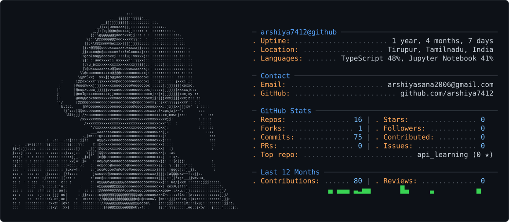

# 💫 About Me:
Full-Stack AI Builder & B.Tech AIDS student. I leverage AI coding tools (Cursor, Copilot) to stitch APIs, TypeScript frontends, and Python ML backends into work

<picture>
  <source media="(prefers-color-scheme: dark)" srcset="dark_mode.svg" />
  
</picture>

## 🌐 Socials:
    

# 💻 Tech Stack:
                    
# 📊 GitHub Stats:
 
 

### ✍️ Random Dev Quote

### 🔝 Top Contributed Repo

---

<!-- Proudly created with GPRM ( https://gprm.itsvg.in ) -->
